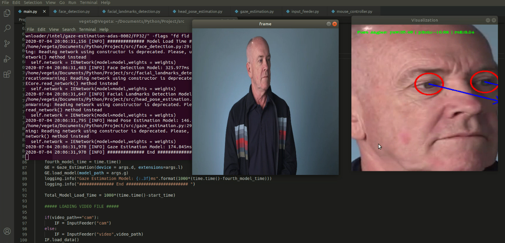

# Computer Pointer Controller

## Introduction
Computer Pointer Controller app is used to control the movement of mouse pointer by the direction of eyes and also estimated pose of head. This app takes video as input(video file or camera) and then estimate the gaze of the user's eyes and change the mouse pointer position accordingly. 

## Project Set Up and Installation
#### Install Intel® Distribution of OpenVINO™ toolkit

Refer to this [guide](https://docs.openvinotoolkit.org/latest/) for installing OpenVINO.

#### Initialize the OpenVINO environment

- For Linux, open terminal
```
source /opt/intel/openvino/bin/setupvars.sh
```
- For Windows, open command prompt as Admin
```
cd C:\Program Files (x86)\IntelSWTools\openvino\bin\
```
```
setupvars.bat
```


#### Install pre-trained models

After successfully installing OpenVINO toolkit, we need to install the models required for our project. In this project we require 4 models:-

- [Face Detection Model](https://docs.openvinotoolkit.org/latest/_models_intel_face_detection_adas_binary_0001_description_face_detection_adas_binary_0001.html)
- [Face Landmarks Detection Model](https://docs.openvinotoolkit.org/latest/_models_intel_landmarks_regression_retail_0009_description_landmarks_regression_retail_0009.html)
- [Head Pose Estimation Model](https://docs.openvinotoolkit.org/latest/_models_intel_head_pose_estimation_adas_0001_description_head_pose_estimation_adas_0001.html)
- [Gaze Estimation](https://docs.openvinotoolkit.org/latest/_models_intel_gaze_estimation_adas_0002_description_gaze_estimation_adas_0002.html)

#### Downloading Models

**For Linux**

- face-detection-adas-binary-0001
```
sudo /opt/intel/openvino/deployment_tools/tools/model_downloader/downloader.py --name face-detection-adas-binary-0001
```
- landmarks-regression-retail-0009
```
sudo /opt/intel/openvino/deployment_tools/tools/model_downloader/downloader.py --name landmarks-regression-retail-0009
```
- head-pose-estimation-adas-0001
```
sudo /opt/intel/openvino/deployment_tools/tools/model_downloader/downloader.py --name head-pose-estimation-adas-0001
```
- gaze-estimation-adas-0002
```
sudo /opt/intel/openvino/deployment_tools/tools/model_downloader/downloader.py --name gaze-estimation-adas-0002
```

**For Windows**

- face-detection-adas-binary-0001
```
python "C:/Program Files (x86)/IntelSWTools/openvino/deployment_tools/tools/model_downloader/downloader.py" --name "face-detection-adas-binary-0001"
```
- landmarks-regression-retail-0009
```
python "C:/Program Files (x86)/IntelSWTools/openvin/deployment_tools/tools/model_downloader/downloader.py" --name "landmarks-regression-retail-0009"
```
- head-pose-estimation-adas-0001
```
python "C:/Program Files (x86)/IntelSWTools/openvino/deployment_tools/tools/model_downloader/downloader.py" --name "head-pose-estimation-adas-0001"
```
- gaze-estimation-adas-0002
```
python "C:/Program Files (x86)/IntelSWTools/openvino/deployment_tools/tools/model_downloader/downloader.py" --name "gaze-estimation-adas-0002"
```
#### Clone the Repository

```
git clone https://github.com/suryaprabhakar414/Computer-Pointer-Controller-OpenVINO.git
```
#### Create a Virtual Environment

**For Windows**
```
cd Computer-Pointer-Controller-OpenVINO.git
```
```
virtualenv Virtual_Env
```

**For Linux**
```
cd Computer-Pointer-Controller-OpenVINO
```
```
python -m venv Virtual_Env
```

#### Install the requirements
```
pip install -r requirements.txt
```

#### Activate the Virtual Environment

**For Windows**
```
Virtual_Env\Scripts\activate
```
**For Linux**
```
source Virtual_Env/bin/activate
```

## Running the Application

- CPU
```
python <path to main.py> -f <path to face detection directory> -fl <path to landmarks regression retail directory> -hp <path to head pose estimation directory> -g <path to gaze estimation directory> -i <path to input video> -d CPU
```
- GPU
```
python <path to main.py> -f <path to face detection directory> -fl <path to landmarks regression retail directory> -hp <path to head pose estimation directory> -g <path to gaze estimation directory> -i <path to input video> -d GPU
```
- FPGA
```
python <path to main.py> -f <path to face detection directory> -fl <path to landmarks regression retail directory> -hp <path to head pose estimation directory> -g <path to gaze estimation directory> -i <path to input video> -d HETERO:FPGA,CPU
```
- VPU (NCS2)
```
python <path to main.py> -f <path to face detection directory> -fl <path to landmarks regression retail directory> -hp <path to head pose estimation directory> -g <path to gaze estimation directory> -i <path to input video> -d MYRIAD 
```
## Demo

```
python3 main.py -f "/opt/intel/openvino_2020.2.120/deployment_tools/tools/model_downloader/intel/face-detection-adas-binary-0001/FP32-INT1/" -fl "/opt/intel/openvino_2020.2.120/deployment_tools/tools/model_downloader/intel/landmarks-regression-retail-0009/FP32/" -hp "/opt/intel/openvino_2020.2.120/deployment_tools/tools/model_downloader/intel/head-pose-estimation-adas-0001/FP32/" -g "/opt/intel/openvino_2020.2.120/deployment_tools/tools/model_downloader/intel/gaze-estimation-adas-0002/FP32/" -i  "/home/vegeta/Documents/Python/Project/bin/demo.mp4" -d CPU -flags "fd fld hp ge"
```



## Documentation

### Command Line Arguments

-  -h, --help    show this help message and exit
-  -i(required): Specify Path to video file or enter cam for webcam
-  -f(required): Specify Path to folder(.xml and .bin) of Face Detection model.
-  -fl(required): Specify Path to folder(.xml and .bin) of Facial Landmark Detection model.
                
-  -hp(required): Specify Path to folder(.xml and .bin) of Head Pose Estimation model.
                
-  -g(required): Specify Path to folder(.xml and .bin) of Gaze Estimation model.
                
-  -flags(optional):  Specify the flags from fd, fld, hp, ge like --flags fd hp fld (Seperate each flag by space) for see the visualization of different model outputs of each frame, fd for Face Detection, fld for Facial Landmark Detection hp for Head Pose Estimation, ge for Gaze Estimation.

-  -prob(optional): Probability threshold for model to detect the face accurately from the video frame.

-  -d(optional): Specify the target device to infer on: CPU, GPU, FPGA or MYRIAD is acceptable. Sample will look for a suitable plugin for device specified (CPU by default).
-  -l(optional): MKLDNN (CPU)-targeted custom layers. Absolute path to a shared library with the kernels impl.

-  -it(optional): Inference type, sync for Synchronous or async for Asychronous


## Benchmarks
*TODO:* Include the benchmark results of running your model on multiple hardwares and multiple model precisions. Your benchmarks can include: model loading time, input/output processing time, model inference time etc.

## Results
*TODO:* Discuss the benchmark results and explain why you are getting the results you are getting. For instance, explain why there is difference in inference time for FP32, FP16 and INT8 models.

## Stand Out Suggestions
This is where you can provide information about the stand out suggestions that you have attempted.

### Async Inference
If you have used Async Inference in your code, benchmark the results and explain its effects on power and performance of your project.

### Edge Cases
There will be certain situations that will break your inference flow. For instance, lighting changes or multiple people in the frame. Explain some of the edge cases you encountered in your project and how you solved them to make your project more robust.
